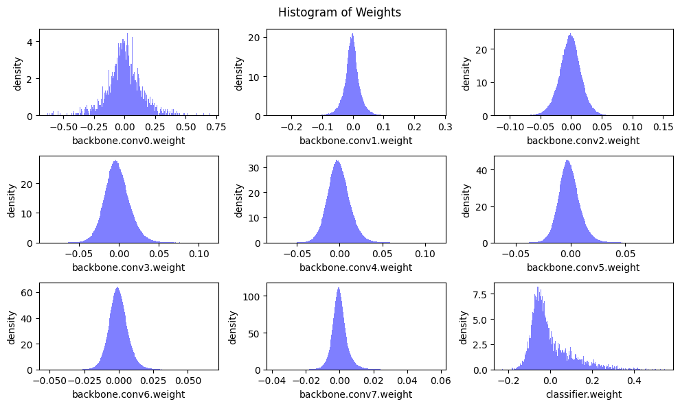
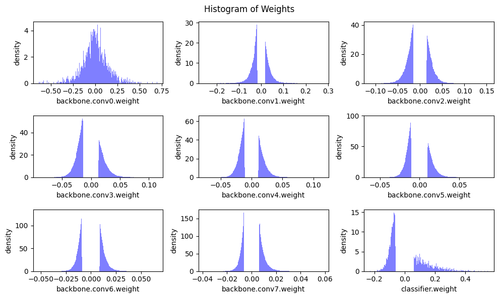
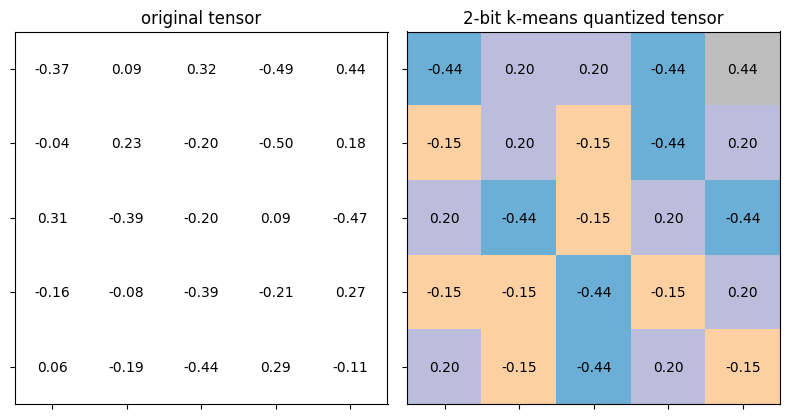

# Pruning, Quantization

Pruning and Quantization of VGG16 Network for Image Classification on CIFAR10 dataset. This involves both fine-grained pruning and channel pruning. The model is also K-means quantized.

## VGG Network 

## Pruning Visualization

<table>
  <tr>
      <td align = "center">  </td>
  </tr>
  <tr>
      <td align = "center"> Magnitude based Fine Grained Pruning </td>
  </tr>
</table>

<table>
  <tr>
      <td align = "center">  </td>
      <td align = "center">  </td>
  </tr>
  <tr>
      <td align = "center"> Before Pruning </td>
      <td align = "center"> After Pruning </td>
  </tr>
</table>

## Quantization Visualization

<table>
  <tr>
      <td align = "center">  </td>
  </tr>
  <tr>
      <td align = "center"> K-means Quantization for 2 bits </td>
  </tr>
</table>
